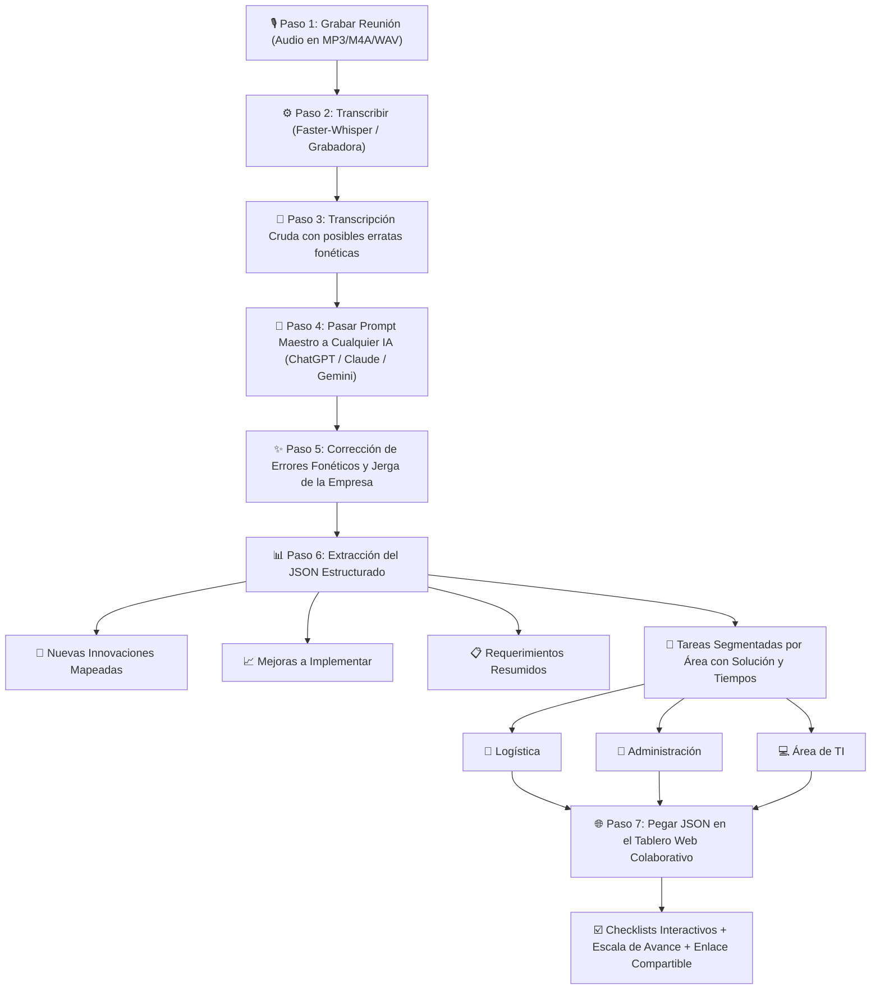

# 📋 PROTOCOLO MAESTRO DE GESTIÓN QUINCENAL DE INCIDENCIAS CON IA

> **Objetivo:** Este documento define el flujo estándar y repetible para procesar audios de reuniones quincenales, subsanar fallos de transcripción, extraer mejoras, innovaciones y requerimientos, segmentar tareas para **Logística, Administración y Área de TI**, y generar soluciones técnicas automáticas listas para el tablero web colaborativo.

---

## 1. Diagrama del Flujo de Trabajo (Sprint de 2 Semanas)



---

## 2. Cómo Repetir este Flujo con Cualquier Otra IA (ChatGPT, Claude, Gemini, DeepSeek)

Si en lugar de procesar el audio automáticamente en este equipo decides usar otra IA en una ventana de chat externa, sigue estos **3 sencillos pasos**:

### Paso A: Obtén la Transcripción de tu Reunión
- Puedes transcribir tu audio ejecutando el archivo `ejecutar_procesamiento_audio.bat` (usando Faster-Whisper local gratuito) o usando cualquier servicio de transcripción de tu preferencia.

### Paso B: Copia el Prompt Maestro
- Abre el archivo `PROMPT_MAESTRO_ANALISIS.txt` (o copia el bloque de la **Sección 3** de este documento).
- Pégalo en tu chat con ChatGPT, Claude, DeepSeek o Gemini.
- Al final del prompt, pega la transcripción cruda de tu reunión.

### Paso C: Importa el JSON en la Página Web
1. La IA te responderá con un único bloque de código en formato `JSON`.
2. Copia todo ese bloque `JSON`.
3. Abre tu tablero web colaborativo y haz clic en el botón **"Nuevo Audio / Datos"** (arriba a la derecha).
4. Selecciona la pestaña **"2. Pegar JSON / Salida de Otra IA"**.
5. Pega el código JSON y presiona **"Aplicar y Actualizar Tablero"**.
6. **¡Listo!** El tablero se actualizará al instante:
   - Se recalculará la escala de avance quincenal.
   - Aparecerán las nuevas tareas de Logística, Administración y TI con sus checkboxes.
   - Cada tarea tendrá habilitado su botón **"💡 Ver Solución Sugerida (IA)"** con los pasos de resolución.

---

## 3. Texto del Prompt Maestro (Listo para Copiar y Pegar)

```text
Eres un Consultor Senior en Operaciones, TI y Cadena de Suministro.
A continuación te proporciono la transcripción en bruto de una reunión de trabajo quincenal.

Los transcriptores automáticos de audio suelen cometer errores fonéticos y de términos técnicos. Tu primer deber es interpretar contextualmente y corregir esos errores (por ejemplo: 'té y' o 'te i' debe ser 'Área de TI'; 'deploi' debe ser 'deploy'; 'r p' debe ser 'ERP'; 'monjaro' debe ser 'Mounjaro'; términos de 'counter', 'almacén', 'backup', 'deadlock', 'SKU', etc.).

Debes generar EXCLUSIVAMENTE una respuesta en formato JSON estrictamente válido, sin texto introductorio ni explicaciones adicionales, siguiendo este esquema exacto:

{
  "metadata": {
    "id_reunion": "REUNION-AAAA-MM-DD",
    "titulo_reunion": "Título representativo y profesional de la sesión quincenal",
    "fecha_reunion": "AAAA-MM-DD",
    "periodo_sprint": "Ejemplo: 16 de Septiembre al 30 de Septiembre de 2026",
    "proxima_reunion": "Fecha de la próxima reunión a 14 días (AAAA-MM-DD)",
    "dias_restantes_sprint": 14,
    "resumen_ejecutivo": "Resumen conciso de 2 a 3 párrafos con los acuerdos principales y el foco operativo."
  },
  "requerimientos_resumidos": [
    "Requerimiento claro y sin rodeos 1",
    "Requerimiento claro y sin rodeos 2",
    "Requerimiento claro y sin rodeos 3"
  ],
  "mejoras_implementar": [
    {
      "id": "MEJ-01",
      "titulo": "Título de la mejora de proceso",
      "descripcion": "En qué consiste la mejora y qué cuello de botella soluciona",
      "area_lider": "Logística | Administración | Área de TI",
      "beneficio": "Beneficio directo cuantificable o cualitativo"
    }
  ],
  "nuevas_innovaciones": [
    {
      "id": "INN-01",
      "titulo": "Título de la innovación tecnológica o automatización",
      "descripcion": "Descripción del sistema, integración o herramienta a desarrollar",
      "impacto": "Alto | Estratégico | Medio",
      "estado": "Propuesta | En Prototipo | Aprobado"
    }
  ],
  "areas": [
    {
      "id": "logistica",
      "nombre": "Logística",
      "icono": "🚚",
      "color": "#3b82f6",
      "responsable": "Equipo de Logística, Compras y Almacén",
      "tareas": [
        {
          "id": "LOG-01",
          "titulo": "Nombre claro y directo de la tarea",
          "descripcion": "Detalle operativo y contexto de lo solicitado en la reunión",
          "completada": false,
          "prioridad": "Alta | Media | Normal",
          "proyeccion_tiempo": {
            "estimacion_dias": 3,
            "fecha_limite": "AAAA-MM-DD",
            "etiqueta": "3 días hábiles (Semana 1)"
          },
          "posible_solucion": {
            "diagnostico": "Causa raíz del problema según lo discutido en el audio",
            "propuesta_accion": [
              "Paso 1: Acción concreta y secuencial",
              "Paso 2: Acción concreta y secuencial",
              "Paso 3: Acción concreta y secuencial"
            ],
            "herramientas_sugeridas": ["Nombre de herramienta, software o formato"],
            "impacto_esperado": "Resultado esperado al ejecutar esta solución"
          }
        }
      ]
    },
    {
      "id": "administracion",
      "nombre": "Administración",
      "icono": "🏢",
      "color": "#10b981",
      "responsable": "Gerencia Administrativa y Operaciones",
      "tareas": [
        {
          "id": "ADM-01",
          "titulo": "Título de la tarea administrativa",
          "descripcion": "Detalle de la tarea",
          "completada": false,
          "prioridad": "Alta | Media | Normal",
          "proyeccion_tiempo": {
            "estimacion_dias": 4,
            "fecha_limite": "AAAA-MM-DD",
            "etiqueta": "4 días hábiles"
          },
          "posible_solucion": {
            "diagnostico": "Diagnóstico administrativo",
            "propuesta_accion": ["Paso 1...", "Paso 2..."],
            "herramientas_sugeridas": ["Plantilla de costos", "Procedimiento interno"],
            "impacto_esperado": "Impacto esperado"
          }
        }
      ]
    },
    {
      "id": "ti",
      "nombre": "Área de TI",
      "icono": "💻",
      "color": "#8b5cf6",
      "responsable": "Desarrollo de Software, Sistemas e Infraestructura",
      "tareas": [
        {
          "id": "TI-01",
          "titulo": "Título técnico o correctivo de TI",
          "descripcion": "Detalle técnico del requerimiento o bug",
          "completada": false,
          "prioridad": "Alta | Media | Normal",
          "proyeccion_tiempo": {
            "estimacion_dias": 2,
            "fecha_limite": "AAAA-MM-DD",
            "etiqueta": "2 días hábiles (Prioridad Inmediata)"
          },
          "posible_solucion": {
            "diagnostico": "Diagnóstico técnico de sistemas",
            "propuesta_accion": [
              "Paso 1: Diagnosticar logs o tablas",
              "Paso 2: Desarrollar parche o consulta optimizada",
              "Paso 3: Desplegar en producción y monitorear"
            ],
            "herramientas_sugeridas": ["SQL Profiler", "Postman", "Git"],
            "impacto_esperado": "Estabilidad del sistema y eliminación del error"
          }
        }
      ]
    }
  ]
}

TRANSCRIPCIÓN EN BRUTO DE LA REUNIÓN:
[PEGA AQUÍ EL TEXTO DE LA TRANSCRIPCIÓN]
```

---

## 4. Diccionario de Errores Comunes de Transcripción a Tener en Cuenta

Cuando revises o la IA interprete los audios, ten presentes estas confusiones fonéticas frecuentes:

| Lo que suele transcribir el Whisper/IA | Lo que realmente se dijo / Significado correcto |
| :--- | :--- |
| *"área de té y"*, *"te i"*, *"t y"* | **Área de TI** (Tecnologías de la Información) |
| *"e r e p e"*, *"erre pe"* | **ERP** (Sistema de Planificación de Recursos) |
| *"ese ele a"*, *"esela"* | **SLA** (Acuerdo de Nivel de Servicio / Tiempos límite) |
| *"deploi"*, *"diploy"* | **Deploy** (Despliegue a producción de software) |
| *"bacap"*, *"back cap"* | **Backup** (Copia de seguridad en la nube o disco) |
| *"conteo ciego"*, *"stock ciego"* | **Auditoría física ciega de almacén** |
| *"caunter"*, *"conter"* | **Counter** (Área de recepción y atención presencial) |
| *"monyaro"*, *"manjaro"* | **Mounjaro** (Tratamiento farmacológico de salud/bienestar) |
| *"ese ka u"* | **SKU** (Código identificador de stock de almacén) |
| *"deadlok"*, *"dedlock"* | **Deadlock** (Bloqueo mutuo concurrente en base de datos) |
| *"dos fa"*, *"doble factor"* | **2FA** (Autenticación de dos factores) |

---

## 5. Roles y Acciones en el Tablero Web Colaborativo

1. **Logística (🚚):**
   - Accede al tablero por el enlace compartido.
   - Filtra haciendo clic en la píldora **"🚚 Logística"**.
   - Marca con un check las tareas que ya ha completado (el porcentaje de avance aumentará automáticamente).
   - Abre **"💡 Ver Solución Sugerida (IA)"** si necesita el plan de acción paso a paso para desatorar una incidencia.

2. **Administración (🏢):**
   - Monitorea el cumplimiento de convenios, costos, capacitaciones y contratos.
   - Marca los ítems de control realizados.

3. **Área de TI (💻):**
   - Revisa requerimientos de software, parches de bases de datos y seguridad.
   - Aplica los pasos técnicos sugeridos por la IA y documenta la resolución marcando el check.

4. **Dirección / Coordinación General:**
   - Observa la **Escala de Avance del Sprint (2 Semanas)**.
   - Comprueba cuántos días quedan para la siguiente reunión quincenal.
   - Revisa el panel de **Nuevas Innovaciones Mapeadas** para tomar decisiones de inversión o priorización.
